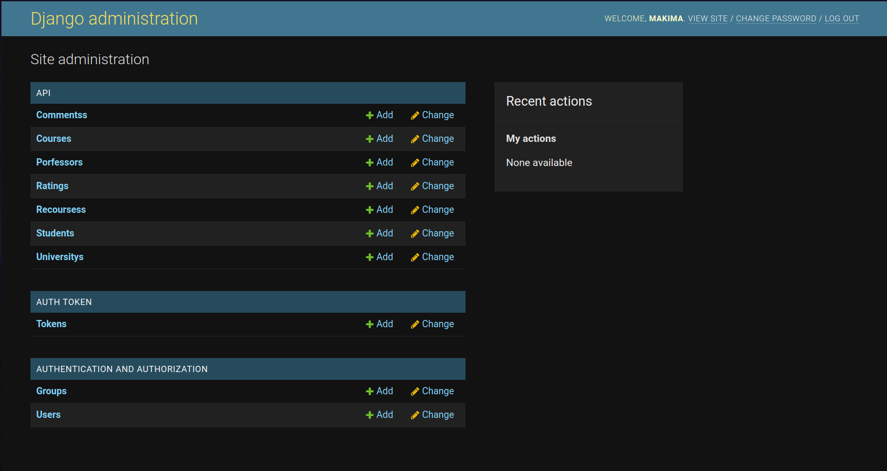

<br/>
<p align="center">
  <a href="https://github.com/jnjl;l../Makima">
    
  </a>

  <h3 align="center">Makima Backend</h3>

  <p align="center">
    Makima is a simple Django backend project for managing the survey system of universities using SQLite3 as the database.
    <br/>
    <br/>
  </p>
</p>


## Table Of Contents

* [About the Project](#about-the-project)
* [Getting Started](#getting-started)
  * [Prerequisites](#prerequisites)
  * [Installation](#installation)

## About The Project



This backend project is a comprehensive survey platform designed for university professors, students, and institutions. It facilitates registration for universities, professors, and students while empowering universities to verify and confirm their affiliated professors. Professors, once approved, can seamlessly register their courses, upload course materials, and provide relevant explanations within the system. Students, in turn, can explore and enroll in courses offered by professors, access course resources, and express their feedback and opinions through ratings and reviews.

## Getting Started

Follow these steps to clone and set up the Makima project on your local machine:

### Prerequisites

Make sure you have the following prerequisites installed on your system:

- Python 3.x
- pip (Python package manager)

### Installation

1. Clone the Repository

You can clone the repository using either HTTPS or SSH:

**HTTPS:**
```sh
git clone https://github.com/Kiana8181/MakimaBackend-EnglishVersion.git
```

**SSH:**
```sh
git clone git@github.com:Kiana8181/MakimaBackend-EnglishVersion.git
```

     
2. Create a Virtual Environment

For Linux users:
```sh
python3 -m venv venv
source venv/bin/activate
```

For Windows users:
```sh
python -m venv venv
venv\Scripts\activate
```

    
3. Install Requirements

Install the project dependencies using pip:

```sh
pip install -r requirements.txt
```


   
4. Make Migrations

For Linux users:
```sh
python3 manage.py makemigrations
python3 manage.py migrate
```

For Windows users:
```sh
python manage.py makemigrations
python manage.py migrate
```


     
5. Create a Superuser

For Linux users:
```sh
python3 manage.py createsuperuser
```

For Windows users:
```sh
python manage.py createsuperuser
```


    
6. Final Checks

Start the development server:

For Linux users:
```sh
python3 manage.py runserver
```

For Windows users:
```sh
python manage.py runserver
```

You can now access the Makima backend at http://localhost:8000/.
